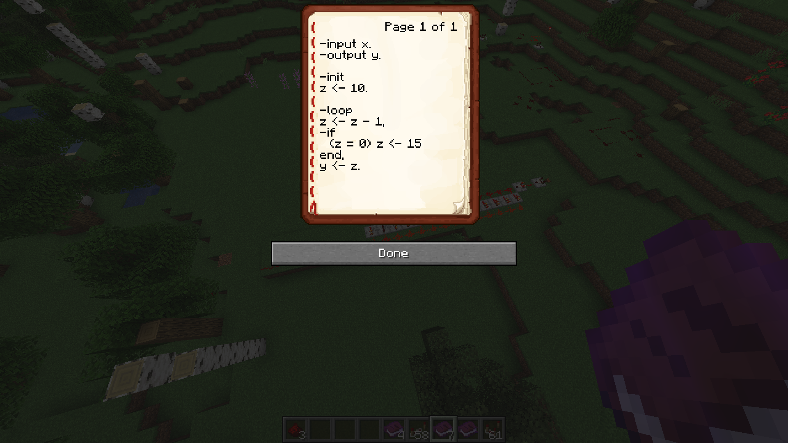

# Redstone Integrated Circuits  
A spigot plugin for Minecraft which allows for 'comparators' and 'repeators' to be programmed using books.  
  
## Development State  
The functionality which changes the behaviours of the redstone components is fully implemented, however currently the compiler can only understand very basic instructions (no code blocks, if statements can only be a single instruction long and no loops currently)

## Example
A sample program:  

This gives the output:  

https://user-images.githubusercontent.com/54404449/133078606-d099535a-5bda-4ca2-ae06-7866df01b999.mp4
